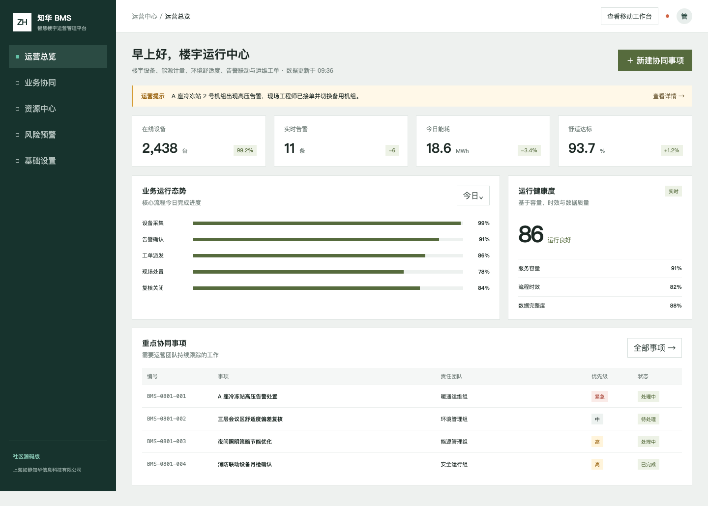
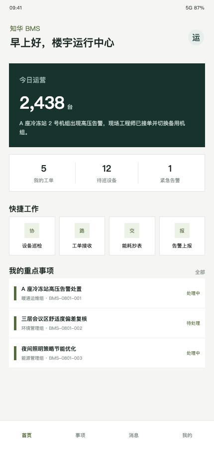

# ZhuaTech BMS

## 让楼宇运行状态、告警和工单在同一张图上闭环

ZhuaTech BMS 是知华科技（上海如静知华信息科技有限公司）面向智慧楼宇场景发布的社区源码工程。它以设备在线、能源计量、舒适度、告警联动和运维工单为核心，提供 Java 后端、MySQL 数据层、Vue 管理端和移动运维 H5。

官方网站：[https://www.zhuatech.cn/](https://www.zhuatech.cn/)



### 运行驾驶舱

管理端聚合在线设备、关键告警、分区能耗、舒适度和重点处置事项；规则接口将能耗偏差、离线设备和超期维保转换为可解释的楼宇健康状态。

| 监测域 | 示例指标 | 处置方向 |
| --- | --- | --- |
| 机电设备 | 在线率、关键告警、超期维保 | 告警确认与工单派发 |
| 能源运营 | 日能耗、基线偏差、分区趋势 | 策略优化与异常排查 |
| 环境品质 | 温湿度、新风、舒适达标率 | 参数校准与现场复核 |
| 运维闭环 | 待办、处理中、复核关闭 | 班组协同与审计留痕 |



### 移动作业

H5 页面适用于设备巡检、工单接收、能耗抄表和现场告警上报。管理/操作员接口权限隔离，演示数据不包含真实楼宇地址、设备标识或生产控制指令。

### 技术与接口

- 后端：Java 21、Spring Boot 4、Spring Security、JPA、MySQL。
- 前端：Vue 3、Vite、响应式 CSS。
- 部署：Docker Compose。
- 规则：`POST /api/admin/building-health` 输出 `NORMAL / WATCH / CRITICAL` 和行动建议。
- 文档：[API](docs/API.md) · [架构](docs/ARCHITECTURE.md) · [安全](SECURITY.md)。

```bash
cp .env.example .env
docker compose up --build
```

访问 `http://localhost:8090`，本地账号为 `admin / admin123`、`operator / operator123`。上线前必须更换默认凭据；接入真实控制网络时还应实施网络分区、指令双确认和设备侧安全策略。

## 个人非商业许可

本工程仅能用于个人非商业学习交流。未经上海如静知华信息科技有限公司书面授权，不得用于企业内部生产、楼宇实际控制、商业部署、SaaS、收费下载、项目交付、投标、售卖或其他获利行为。该许可含非商业限制，不属于 OSI 认可的开源许可证，详情见 [LICENSE](LICENSE)。

## 深度定制

如需对接 BACnet、Modbus、MQTT、边缘网关、能源平台或多项目运维，请通过官网或微信联系知华科技。

<p align="center">
  
  &nbsp;&nbsp;&nbsp;&nbsp;
  
</p>

关键词：知华科技 BMS、智慧楼宇系统、楼宇自控、能源管理、设备告警、移动运维、Java BMS、上海软件定制开发。

## 室内舒适度联动控制

新增 `POST /api/bms/insights/indoor-comfort-control`，根据温度、湿度、二氧化碳、占用人数和设备故障输出舒适度分及 `NORMAL / ADJUST / MAINTENANCE / VENTILATE_NOW`，同时给出新风、除湿、维修和无人节能动作。
